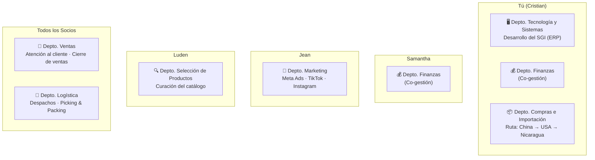
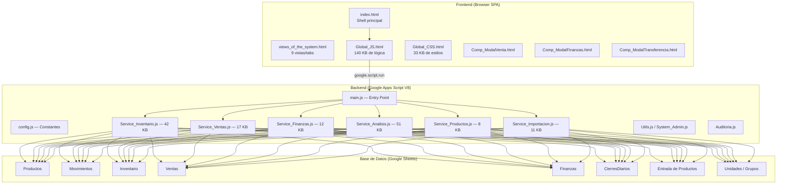
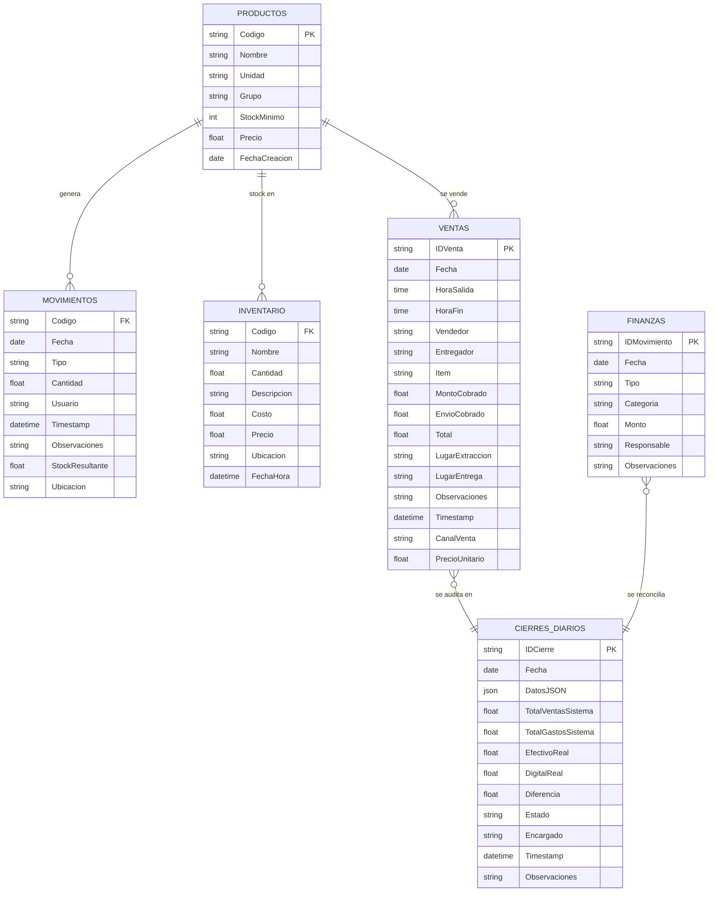
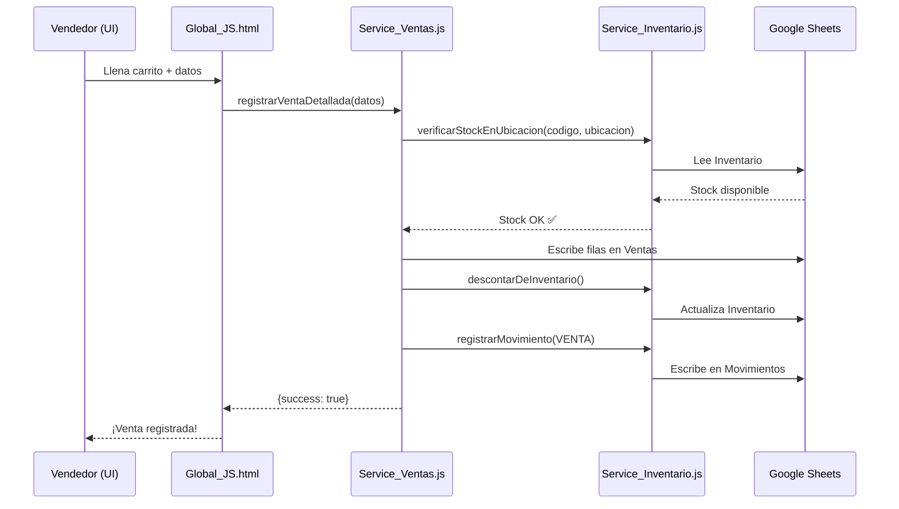
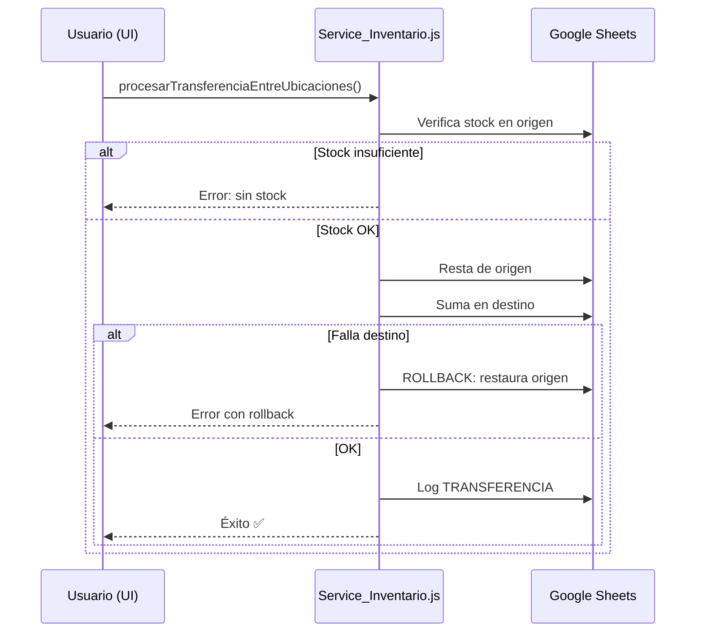
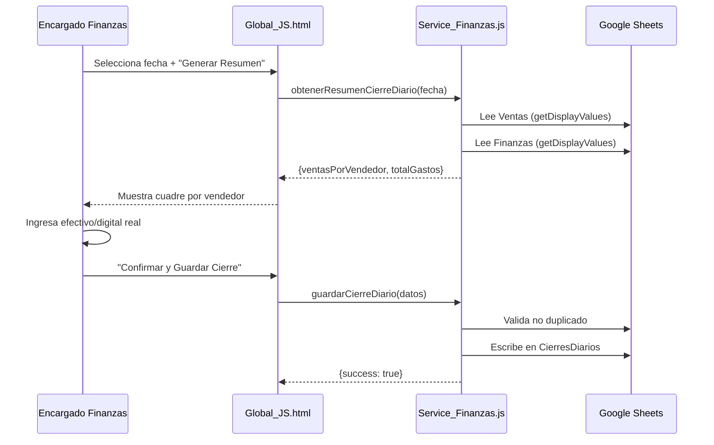

# 🏢 Análisis Ejecutivo Integral: La Comarca

> **Fecha de Análisis:** 23 de julio de 2026
> **Alcance:** Negocio completo + Sistema SGI La Comarca (ERP interno)
> **Fuentes:** Código fuente (21 archivos), documentación técnica, resumen ejecutivo del fundador, datos operativos

---

## 1. Radiografía del Negocio

### 1.1 Identidad Corporativa

| Dimensión | Detalle |
|:---|:---|
| **Razón Comercial** | La Comarca |
| **Antigüedad** | 1.5 años (Fase de escalabilidad) |
| **Nicho** | Ropa y accesorios para gimnasio/fitness (compresión, shorts, straps, rodilleras) |
| **Modelo** | Importación internacional (China → USA → Nicaragua) + B2C vía Social Commerce |
| **Mercado Objetivo** | Aspiracional, visual, alta recurrencia → Alto Lifetime Value (LTV) |

### 1.2 Estructura del Equipo (4 Socios / 7 Departamentos)



| Departamento | Responsable(s) | Función Principal |
|:---|:---|:---|
| **Tecnología y Sistemas** | Tú | Desarrollo y mantenimiento del SGI (ERP propio) |
| **Compras e Importación** | Tú | Gestión de la cadena de suministro internacional |
| **Finanzas** | Tú + Samantha | Control financiero, cierres diarios, flujo de caja |
| **Marketing** | Jean | Generación de demanda, contenido, pauta digital |
| **Selección de Productos** | Luden | Curación y análisis del catálogo de productos |
| **Ventas** | Todos | Atención, negociación y cierre de ventas |
| **Logística** | Todos | Despachos, Picking & Packing, entregas |

> [!NOTE]
> El inventario está **distribuido físicamente** entre 3 ubicaciones: Casa Dylan, Casa Luden y Casa Jean. Esto requiere una alta sincronización logística, que el SGI ya cubre con su módulo de transferencias con rollback automático. Los departamentos de **Ventas** y **Logística** son compartidos entre los 4 socios, lo que refleja una operación ágil donde todos participan en la cadena de valor.

### 1.3 Salud Financiera

| Indicador | Valor |
|:---|:---|
| **Volumen de Ventas** | 2–3 ventas diarias consistentes |
| **Margen Bruto** | ~52% (sólido para retail de importación) |
| **Gastos Fijos Mensuales** | ~$100 USD (estructura ultra-eficiente) |
| **Deuda Activa** | 2 cuotas restantes × $200 USD (préstamo de $2,000) |
| **Fuente de Pago de Deuda** | 100% flujo de caja orgánico del negocio ✅ |

> [!TIP]
> Con un margen del 52% y gastos fijos de solo $100/mes, La Comarca tiene un **punto de equilibrio extremadamente bajo** (~$192/mes). Esto le da una resiliencia financiera excepcional y capacidad de reinversión agresiva una vez liquidada la deuda.

### 1.4 Estrategia Comercial

| Canal | Estado Actual | Prioridad Futura |
|:---|:---|:---|
| Facebook Marketplace | 95% del tráfico (orgánico) | Mantener como motor principal |
| Instagram | En desarrollo | Alta — Construcción de marca |
| TikTok | En desarrollo | Alta — Contenido aspiracional/fitness |
| WhatsApp Business | Incipiente | Media — Base de datos propia |
| Meta Ads (Pauta) | Pendiente | Alta — Post liquidación de deuda |

---

## 2. Arquitectura del Sistema SGI La Comarca

### 2.1 Stack Tecnológico



### 2.2 Módulos del Sistema

| # | Módulo | Archivo Principal | Funciones Clave | Hojas que Lee/Escribe |
|:--|:---|:---|:---|:---|
| 1 | **Dashboard** | Service_Analisis.js | KPIs, alertas de stock, tendencias mensuales | Todas (lectura) |
| 2 | **Entrada de Productos** | Service_Inventario.js | `insertarProductoConUbicacion()` | Productos, Inventario, Movimientos, Entrada |
| 3 | **Movimientos** | Service_Inventario.js | `registrarMovimiento()` | Movimientos |
| 4 | **Inventario** | Service_Inventario.js | `obtenerStock()`, `obtenerStockPorUbicacion()` | Productos, Movimientos, Inventario |
| 5 | **Ventas** | Service_Ventas.js | `registrarVentaDetallada()`, `calcularKPIsVentas()` | Ventas, Inventario, Movimientos |
| 6 | **Finanzas** | Service_Finanzas.js | `registrarMovimientoFinanciero()` | Finanzas |
| 7 | **Cierre Diario** | Service_Finanzas.js | `obtenerResumenCierreDiario()`, `guardarCierreDiario()` | Ventas, Finanzas, CierresDiarios |
| 8 | **Transferencias** | Service_Inventario.js | `procesarTransferenciaEntreUbicaciones()` | Inventario, Movimientos |
| 9 | **Analytics (BI)** | Service_Analisis.js | `obtenerDatosAnaliticos()` | Todas (lectura) |
| 10 | **Importación Masiva** | Service_Importacion.js | `importarInventarioMasivo()` | Productos, Inventario, Movimientos |
| 11 | **Auditoría** | Auditoria.js | `ajustarInventarioAuditoriaDesdeOtroArchivo()` | Inventario, Movimientos (+ hoja externa) |

### 2.3 Esquema de Base de Datos (9 Hojas)



### 2.4 Flujos de Datos Principales

````carousel
#### 🛒 Flujo de Venta

<!-- slide -->
#### 🔄 Flujo de Transferencia

<!-- slide -->
#### 💰 Flujo de Cierre Diario

````

---

## 3. Fortalezas del Sistema

| # | Fortaleza | Impacto |
|:--|:---|:---|
| 1 | **Diseño Mobile-First** | Vendedores y despachadores pueden operar desde el celular sin fricciones |
| 2 | **Rollback transaccional** en transferencias | Protege contra corrupción de datos si falla una operación a medias |
| 3 | **Arquitectura modular** (Clean Code) | Cada módulo está en su propio archivo, facilitando mantenimiento |
| 4 | **Multi-almacén nativo** | Soporta Casa Dylan, Casa Luden, Casa Jean con stock independiente |
| 5 | **Prorrateo automático de envíos** | Distribuye costos de envío equitativamente entre items de una venta |
| 6 | **Cierre Diario con reconciliación** | Permite auditar vendedores y detectar faltantes de caja diariamente |
| 7 | **Motor de BI integrado** | Dashboard analítico con KPIs, tendencias, alertas y SOPs automáticos |
| 8 | **Importación masiva con LockService** | Protege contra concurrencia en cargas batch de inventario |
| 9 | **Deduplicación de ventas** | Sistema de "huella digital" para detectar registros duplicados |
| 10 | **Costo de infraestructura: $0** | Google Sheets + GAS = Sin servidores, sin hosting, sin costos mensuales |

---

## 4. Vulnerabilidades y Riesgos Detectados

### 🔴 Críticos

> [!CAUTION]
> **Seguridad Pública Total:** La aplicación está configurada como `access: ANYONE_ANONYMOUS`. Cualquier persona con la URL tiene acceso completo al sistema: inventario, finanzas, ventas, datos de clientes. Esto es un **riesgo existencial** para el negocio.

> [!CAUTION]
> **Condiciones de Carrera (Race Conditions):** Las funciones transaccionales de ventas e inventario (`registrarVentaDetallada`, `registrarMovimiento`) **no usan `LockService`**. Si dos vendedores registran una venta simultáneamente, una puede sobreescribir a la otra, perdiendo datos financieros de forma irrecuperable.

### 🟡 Importantes

> [!WARNING]
> **Cuello de Botella O(N×M):** `obtenerStock()` llama a `calcularStock()` por cada producto, y cada llamada recorre TODA la hoja de Movimientos. Con 1,000 productos y 5,000 movimientos = 5 millones de iteraciones. Google Apps Script tiene límite de 6 minutos de ejecución.

> [!WARNING]
> **Base de datos plana sin relaciones:** Las ventas duplican datos de cabecera (vendedor, lugar, fecha) en cada fila de item en vez de usar un modelo Cabecera-Detalle (`Ventas_Cabecera` + `Ventas_Detalle`).

### 🟠 Moderados

| Riesgo | Detalle |
|:---|:---|
| **setTimeout falso-positivo** | El frontend usa un timer de 10s que muestra "Error" aunque la operación sí se completó, causando re-envíos duplicados |
| **Sin respaldos automáticos** | No hay mecanismo de backup periódico de la hoja de Google Sheets |
| **Sin roles/permisos** | Todos los usuarios ven y pueden hacer todo: ventas, finanzas, configuración, auditoría |
| **Dependencia monolítica** | 140 KB en un solo archivo `Global_JS.html` dificulta depuración y mantenimiento |

---

## 5. SOPs Identificados en el Sistema

El sistema ya implementa varios Procedimientos Operativos Estándar de forma programática:

1. **SOP de Pre-validación de Stock:** Antes de confirmar una venta, el sistema verifica disponibilidad exacta en el almacén seleccionado. Si no hay stock, bloquea la operación.

2. **SOP de Despacho Multi-ubicación:** El carrito de ventas permite seleccionar de qué casa sale cada item. El sistema descuenta independientemente por ubicación.

3. **SOP de Transferencia Segura:** Verificación → Descuento origen → Suma destino → Rollback automático si falla = Integridad garantizada.

4. **SOP de Cierre de Caja:** Generación automática de resumen diario → Cuadre por vendedor → Registro de diferencias → Historial auditable. Solo 1 cierre por día permitido.

5. **SOP de Identificación de Ventas:** Formato `V-YYYYMMDD-HHMMSS` permite rastrear cualquier venta hasta su timestamp exacto. El sistema tiene funciones de recuperación de fechas perdidas basadas en este patrón.

6. **SOP de Auditoría Física:** El módulo de `Auditoria.js` cruza conteo físico real (desde una hoja externa) contra el sistema y genera ajustes automáticos.

---

## 6. Hoja de Ruta Estratégica Recomendada

### Fase 1: Seguridad y Estabilidad (Urgente — 1 semana)

- [ ] **Implementar autenticación:** Cambiar `access` a `ANYONE` (requiere Google login) o crear pantalla de login con contraseña
- [ ] **Agregar `LockService`** a todas las funciones transaccionales (ventas, transferencias, movimientos financieros)
- [ ] **Eliminar `setTimeout` de error:** Confiar exclusivamente en `withSuccessHandler` / `withFailureHandler`

### Fase 2: Rendimiento (Importante — 2 semanas)

- [ ] **Refactorizar `obtenerStock()`** para construir un `stockMap` en una sola pasada de la hoja de Movimientos
- [ ] **Refactorizar `obtenerResumen()`** con la misma técnica de agregación en memoria
- [ ] **Optimizar `obtenerHistorial()`** precargando ventas en un Map en vez de consultar por cada movimiento
- [ ] **Implementar caché de sesión** (`CacheService`) para datos que no cambian frecuentemente (listas de productos, categorías)

### Fase 3: Estructura de Datos (Medio plazo — 1 mes)

- [ ] Migrar ventas a modelo **Cabecera-Detalle** (`Ventas_Cabecera` + `Ventas_Detalle`)
- [ ] Crear sistema de **roles y permisos** (Vendedor, Despachador, Finanzas, Admin)
- [ ] Implementar **respaldos automáticos** con trigger programado (copia de hoja mensual)

### Fase 4: Crecimiento Comercial (Post-deuda)

- [ ] Activar **Meta Ads** con presupuesto inicial del 15% de utilidades
- [ ] Construir **catálogo digital** en Instagram Shopping
- [ ] Implementar **WhatsApp Business API** para seguimiento post-venta automatizado
- [ ] Agregar módulo de **CRM básico** al SGI (historial de clientes, frecuencia de compra, LTV)

---

## 7. Métricas Clave del Código

| Métrica | Valor |
|:---|:---|
| **Total de archivos** | 26 (11 JS + 8 HTML + 2 XLSX + 1 PDF + 1 JSON + 3 config) |
| **Líneas de código estimadas** | ~12,000+ (solo JS + HTML) |
| **Archivo más grande** | `Global_JS.html` — 140 KB |
| **Motor de BI** | `Service_Analisis.js` — 51 KB |
| **Motor de Inventario** | `Service_Inventario.js` — 42 KB |
| **Hojas de base de datos** | 9 hojas activas |
| **Almacenes soportados** | 3 (Casa Dylan, Casa Luden, Casa Jean) |
| **Canales de venta rastreados** | 5 (Facebook Marketplace, WhatsApp, Instagram, TikTok, Presencial) |

---

> [!IMPORTANT]
> **Conclusión General:** La Comarca tiene un producto tecnológico propio (SGI) que le da una ventaja competitiva significativa frente a negocios similares que operan con hojas de Excel manuales. El sistema ya cubre el 90% de las necesidades operativas del negocio. Las prioridades inmediatas deben ser: (1) cerrar la brecha de seguridad del acceso público, (2) resolver las condiciones de carrera antes de que causen pérdida de datos financieros, y (3) optimizar el rendimiento antes de que el volumen de datos exceda los límites de Google Apps Script.
