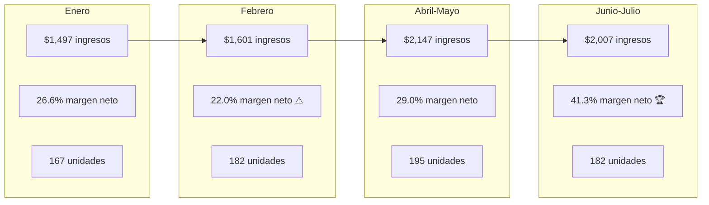

# Análisis de Importaciones 2026 — La Comarca
> **Datos corregidos** del archivo `Importaciones 2026 (4) (1) (1).xlsx`

---

## Resumen Ejecutivo: 5 Importaciones

| Importación | Productos | Unidades | Inversión | Ingresos | Util. Bruta | Util. Neta | Margen Bruto | Margen Neto | Gastos Op. |
|---|---|---|---|---|---|---|---|---|---|
| **Enero** | 9 | 167 | $873 | $1,497 | $699 | $399 | 46.7% | 26.6% | $300 |
| **Febrero** | 7 | 182 | $978 | $1,601 | $652 | $352 | 40.7% | 22.0% | $300 |
| **Abril-Mayo** | 8 | 195 | $1,124 | $2,147 | $1,022 | $622 | 47.6% | 29.0% | $400 |
| **Jun-Jul** | 6 | 182 | $1,177 | $2,007 | $830 | $830 | 41.3% | 41.3% | $0 |
| **TOTAL** | — | **726** | **$4,153** | **$7,252** | **$3,203** | **$2,203** | **44.2%** | **30.4%** | $1,000 |

> [!NOTE]
> **Acumulado 2026:** Han invertido ~$4,153 y generado ~$7,252 en ingresos proyectados, con una utilidad neta acumulada de ~$2,203 después de gastos operativos. Eso es **un retorno de 53% sobre la inversión total**.

---

## Evolución Mes a Mes

**Tendencias clave:**
- 📈 Los ingresos crecieron de $1,497 → $2,147 (+43%) entre Enero y Abril-Mayo
- 📈 El margen neto mejoró drásticamente de 22% → 41.3% entre Febrero y Junio-Julio
- 📉 Febrero fue el mes más débil en margen (22%) — influido por chalecos de lana (margen 22%) y $300 en gastos operativos
- ✅ Junio-Julio es la mejor importación: $830 utilidad neta sin gastos operativos adicionales

---

## Análisis por Producto (Todos los lotes)

### ⭐ Productos Estrella (Margen > 40%, importados 2+ veces)

| Producto | Veces | Und. Totales | Margen Promedio | Costo Unit. NIC | Precio Venta | Veredicto |
|---|---|---|---|---|---|---|
| **Camisa compresión** | 5/5 | 225 | ~49% | $3.63-3.95 | $6.79-8.64 | 🏆 **#1 del catálogo. Nunca sin stock** |
| **Camisa compresión manga larga** | 3/5 | 80 | ~51% | $3.34-4.77 | $8.15-9.45 | 🏆 **Mejor margen consistente** |
| **Camisa compresión sin mangas** | 2/5 | 45 | ~52% | $3.78-4.39 | $8.15-8.64 | 🏆 **Ampliar volumen** |
| **Enterizo deportivo** | 3/5 | 64 | ~45% | $5.89-6.29 | $10-12.16 | ⭐ Consistente y rentable |
| **Straps** | 1/5 | 20 | 55.6% | $2.66 | $6.00 | ⭐ **¿Por qué solo 1 vez? Reordenar** |

### 🟡 Productos Regulares (Margen 30-40%, viables con ajustes)

| Producto | Veces | Margen Venta | Observación |
|---|---|---|---|
| **Cinturón gym** | 2/5 | 40-54% | Buen margen pero baja cantidad (10-12 und) |
| **Flare leggins** | 2/5 | 34-37% | Margen justo. Producto pesado (0.5kg) encarece envío |
| **Jogger** | 1/5 | 41.6% | Solo 10 und. Evaluar demanda real |
| **Shorts YOUNGLA** | 1/5 | 40.2% | Solo 16 und. Potencial si hay demanda |
| **Shorts falda mujer** | 1/5 | 66.7% | ⬆️ **Excelente margen. ¿Por qué solo 1 vez?** |

### 🔴 Productos Problemáticos (Margen < 30% o fuera de nicho)

| Producto | Margen Venta | Problema | Decisión |
|---|---|---|---|
| **Chaleco de lana** | **22.2%** | Peor margen del catálogo. Producto pesado (0.5kg × 50 und = 25kg). Costó $477 y solo genera $613 | 🔴 **No reordenar jamás** |
| **Soporte laptop** | 39.5% | Fuera del nicho fitness | 🔴 No reordenar |
| **Mochila antirobo** | 41.4% | Fuera del nicho fitness | 🔴 No reordenar |
| **Mono deportivo** | 36.0% | Solo 4 unidades, margen bajo | 🟡 Evaluar |

---

## Estructura de Costos: ¿Dónde se va el dinero?

Promediando las 4 importaciones principales:

| Componente | % del Costo Total | Observación |
|---|---|---|
| **Costo del producto** | ~54% | Es el mayor componente |
| **Envío (China→USA + USA→NIC)** | ~38% | Segundo más grande. El envío pesa mucho |
| **Comisiones + envío interno China** | ~8% | Relativamente bajo |

> [!IMPORTANT]
> **El envío representa casi el 40% de tu costo.** Por eso los productos livianos (camisas: 0.2kg) tienen mucho mejor margen que los pesados (chalecos: 0.5kg, bolsos: 0.53kg). **Regla: priorizar productos de menos de 0.3kg por unidad.**

### Impacto del peso en el margen:

| Peso unitario | Ejemplo | Margen promedio |
|---|---|---|
| **0.1-0.2 kg** | Camisas compresión, straps, shorts | **45-56%** ✅ |
| **0.3 kg** | Enterizo, camisa manga larga | **41-51%** ✅ |
| **0.4-0.5 kg** | Cinturón gym, leggins, chalecos | **27-40%** ⚠️ |
| **0.5+ kg** | Gym bags, chalecos | **22-40%** ⚠️ |

---

## Evolución de la Eficiencia Operativa

| Métrica | Enero | Febrero | Abril-Mayo | Jun-Jul | Tendencia |
|---|---|---|---|---|---|
| Ingreso por unidad | $8.96 | $8.80 | $11.01 | $11.03 | 📈 Subiendo |
| Costo por unidad | $5.23 | $5.38 | $5.77 | $6.47 | 📈 Subiendo (cuidado) |
| Utilidad bruta/unidad | $4.18 | $3.58 | $5.24 | $4.56 | ↔️ Estable |
| Gastos operativos | $300 | $300 | $400 | $0 | 📉 Mejorando |
| Productos por lote | 9 | 7 | 8 | 6 | 📉 Más enfocados |

**Hallazgo positivo:** Han ido reduciendo la cantidad de productos por lote (de 9 a 6) y enfocándose más. Eso es correcto — menos SKUs con mayor volumen de los que funcionan.

---

## Sobre la "Posible Inversión"

La hoja "Posible inversión" tiene 8 productos con margen proyectado de 54.1%. Pero hay una alerta:

| Producto | Margen | ¿Encaja en el nicho? | Riesgo |
|---|---|---|---|
| Mouse Ergonómico | 50.1% | ❌ No es fitness | Alto — mismo error que HUD/Mouse Pad |
| Audífonos natación | 52.0% | 🟡 Deportivo pero nicho muy pequeño | Medio — ¿hay demanda en Managua? |
| Headphones | 56.2% | ❌ No es fitness | Alto |
| **Bandas de ejercicio** | **78.2%** | ✅ **Fitness puro** | 🟢 **Bajo — comprar** |
| Smartwatch | 54.3% | 🟡 Wearable, no fitness core | Medio |
| Pestañas magnéticas | 56.0% | ❌ No es fitness | Alto — diferente audiencia |
| Aspiradora | 48.6% | ❌ No es fitness | Alto |
| Inflador portátil | 40.1% | ❌ No es fitness | Alto |

> [!WARNING]
> **De los 8 productos, solo las Bandas de ejercicio (78.2% margen) son claramente del nicho.** Los demás repiten el patrón de Febrero: productos fuera del nicho que históricamente no rotan bien.

---

## Recomendaciones para la Próxima Importación

### Reordenar (Clase A confirmada):
| Producto | Cantidad sugerida | Justificación |
|---|---|---|
| Camisa compresión | 50 | Producto #1, vendido en 5/5 lotes |
| Camisa compresión manga larga | 25-30 | Margen 51%, demanda constante |
| Camisa compresión sin mangas | 25 | Margen 52%, complementa línea |
| Enterizo deportivo | 30 | Margen 45%, vendido en 3/5 lotes |
| Straps | 20-30 | Margen 56%, solo importado 1 vez |
| Shorts falda mujer | 20 | Margen 67%, solo importado 1 vez |

### Evaluar con validación de demanda:
| Producto | Por qué | Acción |
|---|---|---|
| Bandas de ejercicio | 78% margen, fitness puro | Post "próximamente" → si 10+ interesados, comprar 20 |
| Cinturón gym | Buen margen pero baja rotación | Solo si el SGI muestra que se agotó |

### No reordenar:
- Chalecos de lana (22% margen, pesado)
- Soporte laptop, mochila antirobo (fuera de nicho)
- Mouse ergonómico, headphones, aspiradora, pestañas (fuera de nicho)

---

## La fórmula que está funcionando

Basado en 7 meses de data:

> **Producto ideal de La Comarca = Ropa/accesorio fitness + peso ≤ 0.3kg + margen ≥ 40% + precio venta C$150-600**

Los productos que cumplen esos 4 criterios (camisas compresión, straps, enterizo, shorts) representan el **80% de tu utilidad** con solo el **50% del catálogo**. Enfocarse ahí es la movida correcta.
