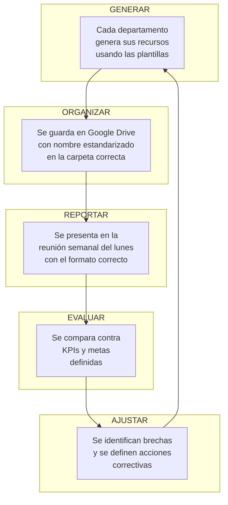

# 📂 Sistema de Gestión de Recursos y Estandarización
## La Comarca — De la Constancia a la Consistencia

> **Constancia** = Hacer las cosas todos los días.
> **Consistencia** = Hacer las cosas todos los días **de la misma forma y con la misma calidad.**
>
> La constancia depende de disciplina. La consistencia depende de **sistemas, plantillas y estándares.**

---

## 1. Mapa de Recursos por Departamento

Cada departamento **genera y consume** recursos. Si no sabes qué produce cada área, no puedes medirla, organizarla ni mejorarla.

### 1.1 Inventario de Recursos

| Departamento | Recurso Generado | Frecuencia | Formato | Dónde Vive Hoy | Dónde Debería Vivir |
|:---|:---|:---|:---|:---|:---|
| **Finanzas** | Cierre diario | Diario | Registro SGI | SGI (CierresDiarios) | ✅ Ya está bien |
| **Finanzas** | Reporte semanal de P&L | Semanal | No existe | — | Google Sheets + SGI |
| **Finanzas** | Reporte mensual de utilidades | Mensual | No existe | — | Google Sheets |
| **Marketing** | Fotos de producto | Por producto | JPG/PNG | Galería del celular | Google Drive estandarizado |
| **Marketing** | Videos/Reels | 5/semana | MP4 | Galería del celular | Google Drive estandarizado |
| **Marketing** | Textos/copies de publicaciones | 5/semana | Texto | Notas del celular | Documento maestro |
| **Marketing** | Calendario de contenido | Semanal | No existe | — | Google Sheets |
| **Marketing** | Métricas de rendimiento | Semanal | No existe | — | Google Sheets |
| **Importación** | Orden de compra | Por importación | No estandarizado | WhatsApp/Email | Google Sheets + Drive |
| **Importación** | Tracking de envío | Por importación | Links sueltos | WhatsApp | Google Sheets |
| **Importación** | Análisis de costos | Por importación | No existe formalmente | — | Google Sheets |
| **Selección** | Análisis de rotación | Mensual | No existe formalmente | — | SGI Analytics + Sheets |
| **Selección** | Propuesta de reorden | Mensual | No existe formalmente | — | Google Sheets |
| **Ventas** | Registro de venta | Por venta | Registro SGI | SGI (Ventas) | ✅ Ya está bien |
| **Ventas** | Catálogo de precios | Permanente | No estandarizado | Memoria/WhatsApp | Google Sheets + PDF |
| **Ventas** | Scripts de venta | Permanente | PDF existente | Archivo suelto | Google Drive |
| **Logística** | Confirmación de entrega | Por despacho | WhatsApp informal | Chat grupal | Formato estandarizado |

> [!IMPORTANT]
> **Diagnóstico:** De los 17 recursos identificados, solo 2 ya viven organizados (los del SGI). Los otros 15 están dispersos entre celulares, chats de WhatsApp, memorias individuales y archivos sueltos. Esto significa que **si un socio se enferma una semana, nadie sabe dónde está nada.**

---

## 2. Estructura Digital de Organización (Google Drive)

Todo recurso del negocio debe vivir en **un solo lugar** accesible para los 4 socios. Google Drive es gratuito y ya lo usan.

### 2.1 Estructura de Carpetas

```
📁 LA COMARCA (Drive compartido)
│
├── 📁 01_FINANZAS
│   ├── 📁 Cierres Diarios (respaldo del SGI)
│   ├── 📁 Reportes Semanales
│   ├── 📁 Reportes Mensuales
│   └── 📄 Presupuesto Maestro 2026.xlsx
│
├── 📁 02_MARKETING
│   ├── 📁 Banco de Fotos
│   │   ├── 📁 Camisas Compresión
│   │   ├── 📁 Shorts
│   │   ├── 📁 Accesorios (straps, rodilleras)
│   │   └── 📁 Lifestyle (clientes, gym)
│   ├── 📁 Banco de Videos
│   │   ├── 📁 Reels Publicados
│   │   └── 📁 Material Crudo
│   ├── 📁 Copies y Textos
│   ├── 📄 Calendario de Contenido.xlsx
│   ├── 📄 Métricas Semanales.xlsx
│   └── 📄 Guía de Marca La Comarca.pdf
│
├── 📁 03_IMPORTACIONES
│   ├── 📁 2026-IMP-001 (por cada importación)
│   │   ├── 📄 Orden de Compra.xlsx
│   │   ├── 📄 Factura del Proveedor.pdf
│   │   ├── 📄 Tracking.txt
│   │   └── 📄 Análisis de Costos.xlsx
│   ├── 📁 2026-IMP-002
│   └── 📄 Historial de Importaciones.xlsx
│
├── 📁 04_PRODUCTOS
│   ├── 📄 Catálogo Maestro de Precios.xlsx
│   ├── 📄 Análisis de Rotación Mensual.xlsx
│   └── 📄 Propuestas de Nuevos Productos.xlsx
│
├── 📁 05_VENTAS
│   ├── 📄 Script de Ventas v1.pdf
│   ├── 📄 Guía de Objeciones y Respuestas.pdf
│   ├── 📄 Catálogo Digital (para compartir).pdf
│   └── 📄 Políticas de Envío y Devolución.pdf
│
├── 📁 06_LOGÍSTICA
│   ├── 📄 Checklist de Despacho.pdf
│   ├── 📄 Guía de Empaque.pdf
│   └── 📄 Zonas de Cobertura y Tarifas.xlsx
│
├── 📁 07_LEGAL_Y_GOBIERNO
│   ├── 📄 Acuerdo de Socios.pdf
│   ├── 📄 Compromisos Departamentales.pdf
│   └── 📄 Acta de Reuniones Mensuales.xlsx
│
└── 📁 08_SISTEMA_SGI
    ├── 📄 Manual de Usuario SGI.pdf
    ├── 📄 Análisis Ejecutivo La Comarca.pdf
    └── 📄 Manual Operativo La Comarca.pdf
```

### 2.2 Convención de Nombres de Archivos

**Regla universal:** `[FECHA]_[TIPO]_[DESCRIPCIÓN].[ext]`

| Tipo de Archivo | Formato del Nombre | Ejemplo |
|:---|:---|:---|
| Reporte semanal | `YYYY-WXX_Reporte_Semanal.xlsx` | `2026-W30_Reporte_Semanal.xlsx` |
| Reporte mensual | `YYYY-MM_Reporte_Mensual.xlsx` | `2026-07_Reporte_Mensual.xlsx` |
| Foto de producto | `PROD_[codigo]_[angulo]_[num].jpg` | `PROD_CMPR-001_frontal_01.jpg` |
| Video/Reel | `VID_[fecha]_[plataforma]_[desc].mp4` | `VID_20260723_IG_short-negro.mp4` |
| Orden de compra | `OC_[fecha]_[proveedor].xlsx` | `OC_20260715_ProveedorChina.xlsx` |
| Acta de reunión | `ACTA_[fecha]_[tipo].pdf` | `ACTA_20260721_Semanal.pdf` |

> [!TIP]
> **¿Por qué importa esto?** Porque cuando tengas 200 fotos de productos y 50 reportes, si no tienen nombre estandarizado, encontrar algo te tomará 10 minutos en vez de 10 segundos. La consistencia en lo pequeño es lo que permite escalar.

---

## 3. Plantillas Estandarizadas

### 3.1 📊 Plantilla: Reporte Semanal de Finanzas

```
╔══════════════════════════════════════════════════════╗
║         LA COMARCA — REPORTE SEMANAL                ║
║         Semana: [DD/MM] al [DD/MM/YYYY]             ║
║         Elaborado por: [Nombre]                      ║
╠══════════════════════════════════════════════════════╣

📈 RESUMEN EJECUTIVO
┌─────────────────────┬──────────┬──────────┐
│ Concepto            │ Semana   │ Acum.Mes │
├─────────────────────┼──────────┼──────────┤
│ Ventas brutas       │ $____    │ $____    │
│ Costo de mercancía  │ $____    │ $____    │
│ Margen bruto        │ $____    │ $____    │
│ Gastos operativos   │ $____    │ $____    │
│ UTILIDAD NETA       │ $____    │ $____    │
│ # de ventas         │ ____     │ ____     │
│ Ticket promedio     │ $____    │ $____    │
└─────────────────────┴──────────┴──────────┘

🔍 DETALLE POR VENDEDOR
┌─────────────┬────────┬──────────┬───────────┐
│ Vendedor    │ Ventas │ Efectivo │ Digital   │
├─────────────┼────────┼──────────┼───────────┤
│ ___         │ $____  │ $____    │ $____     │
│ ___         │ $____  │ $____    │ $____     │
└─────────────┴────────┴──────────┴───────────┘

💰 CIERRES DIARIOS
┌──────┬──────────┬──────────┬─────────────┐
│ Día  │ Esperado │ Real     │ Diferencia  │
├──────┼──────────┼──────────┼─────────────┤
│ Lun  │ $____    │ $____    │ $____       │
│ Mar  │ $____    │ $____    │ $____       │
│ Mié  │ $____    │ $____    │ $____       │
│ Jue  │ $____    │ $____    │ $____       │
│ Vie  │ $____    │ $____    │ $____       │
│ Sáb  │ $____    │ $____    │ $____       │
│ Dom  │ $____    │ $____    │ $____       │
└──────┴──────────┴──────────┴─────────────┘

🚨 ALERTAS Y OBSERVACIONES
• _______________________________________________
• _______________________________________________

╚══════════════════════════════════════════════════════╝
```

### 3.2 📣 Plantilla: Reporte Semanal de Marketing

```
╔══════════════════════════════════════════════════════╗
║         LA COMARCA — MARKETING SEMANAL              ║
║         Semana: [DD/MM] al [DD/MM/YYYY]             ║
║         Responsable: Jean                           ║
╠══════════════════════════════════════════════════════╣

📊 MÉTRICAS DE LA SEMANA
┌─────────────────────────┬────────┬────────┬────────┐
│ Métrica                 │ Meta   │ Real   │ Estado │
├─────────────────────────┼────────┼────────┼────────┤
│ Contenido publicado     │ 5      │ ___    │ 🟢🟡🔴│
│ Alcance total (views)   │ ___    │ ___    │ 🟢🟡🔴│
│ Leads nuevos (mensajes) │ 30     │ ___    │ 🟢🟡🔴│
│ Leads → Venta (conv.)   │ 15%    │ ___%   │ 🟢🟡🔴│
│ Seguidores ganados      │ ___    │ ___    │ 🟢🟡🔴│
└─────────────────────────┴────────┴────────┴────────┘

📱 CONTENIDO PUBLICADO
┌─────┬─────────────┬──────────────┬──────────┬────────┐
│ #   │ Plataforma  │ Tipo         │ Tema     │ Likes  │
├─────┼─────────────┼──────────────┼──────────┼────────┤
│ 1   │ IG/TikTok   │ Reel/Foto/St │ ________ │ ___    │
│ 2   │             │              │          │        │
│ 3   │             │              │          │        │
│ 4   │             │              │          │        │
│ 5   │             │              │          │        │
└─────┴─────────────┴──────────────┴──────────┴────────┘

🏆 TOP 3 CONTENIDOS DE LA SEMANA (mayor engagement)
1. _______________________________________________
2. _______________________________________________
3. _______________________________________________

💡 APRENDIZAJES Y PLAN SEMANA SIGUIENTE
• ¿Qué funcionó? _________________________________
• ¿Qué no funcionó? ______________________________
• Plan próxima semana: ___________________________

╚══════════════════════════════════════════════════════╝
```

### 3.3 📦 Plantilla: Hoja de Importación

```
╔══════════════════════════════════════════════════════╗
║         LA COMARCA — ORDEN DE IMPORTACIÓN           ║
║         ID: 2026-IMP-[###]                          ║
║         Fecha de Solicitud: [DD/MM/YYYY]            ║
╠══════════════════════════════════════════════════════╣

🌐 RUTA: China → USA → Nicaragua

📋 DATOS DEL PROVEEDOR
• Proveedor: ____________________________________
• Plataforma: (Alibaba / 1688 / Directo)
• Contacto: _____________________________________
• Link del producto: ____________________________

📦 PRODUCTOS SOLICITADOS
┌─────┬──────────────┬──────┬──────┬────────┬─────────┐
│ #   │ Producto     │ Cant │ Cost │ Venta  │ Margen% │
├─────┼──────────────┼──────┼──────┼────────┼─────────┤
│ 1   │              │      │ $    │ $      │    %    │
│ 2   │              │      │ $    │ $      │    %    │
│ 3   │              │      │ $    │ $      │    %    │
├─────┼──────────────┼──────┼──────┼────────┼─────────┤
│     │ TOTAL        │      │ $    │ $      │    %    │
└─────┴──────────────┴──────┴──────┴────────┴─────────┘

💲 DESGLOSE DE COSTOS
┌────────────────────────┬──────────┐
│ Concepto               │ Monto    │
├────────────────────────┼──────────┤
│ Costo de productos     │ $        │
│ Envío China → USA      │ $        │
│ Envío USA → Nicaragua  │ $        │
│ Impuestos/Aduanas      │ $        │
│ Otros gastos           │ $        │
├────────────────────────┼──────────┤
│ COSTO TOTAL LANDED     │ $        │
│ COSTO POR UNIDAD       │ $        │
└────────────────────────┴──────────┘

📍 TRACKING
┌────────────────────┬──────────┬───────────┐
│ Etapa              │ Fecha    │ Estado    │
├────────────────────┼──────────┼───────────┤
│ Pedido realizado   │          │ ⬜        │
│ Proveedor envía    │          │ ⬜        │
│ Llega a USA        │          │ ⬜        │
│ Sale de USA        │          │ ⬜        │
│ Llega a Nicaragua  │          │ ⬜        │
│ Registrado en SGI  │          │ ⬜        │
└────────────────────┴──────────┴───────────┘

╚══════════════════════════════════════════════════════╝
```

### 3.4 🔍 Plantilla: Análisis de Rotación de Productos (Luden)

```
╔══════════════════════════════════════════════════════╗
║     LA COMARCA — ANÁLISIS DE ROTACIÓN MENSUAL       ║
║     Mes: [MES YYYY]                                 ║
║     Responsable: Luden                              ║
╠══════════════════════════════════════════════════════╣

📊 CLASIFICACIÓN ABC DEL CATÁLOGO
(Fuente: SGI Dashboard Analítico)

🅰️ CLASE A — Productos Estrella (80% de ingresos)
   → NUNCA deben estar sin stock
┌──────────┬──────────────┬────────┬────────┬─────────┐
│ Código   │ Nombre       │ Ventas │ Stock  │ Acción  │
├──────────┼──────────────┼────────┼────────┼─────────┤
│          │              │        │        │ Reordenar│
└──────────┴──────────────┴────────┴────────┴─────────┘

🅱️ CLASE B — Productos Regulares (15% de ingresos)
   → Mantener stock moderado
┌──────────┬──────────────┬────────┬────────┬─────────┐
│ Código   │ Nombre       │ Ventas │ Stock  │ Acción  │
├──────────┼──────────────┼────────┼────────┼─────────┤
│          │              │        │        │          │
└──────────┴──────────────┴────────┴────────┴─────────┘

🅲 CLASE C — Productos de Baja Rotación (5% de ingresos)
   → Evaluar descuento o descontinuar
┌──────────┬──────────────┬────────┬────────┬─────────┐
│ Código   │ Nombre       │ Ventas │ Stock  │ Acción  │
├──────────┼──────────────┼────────┼────────┼─────────┤
│          │              │        │        │ Liquidar│
└──────────┴──────────────┴────────┴────────┴─────────┘

❌ PRODUCTOS SIN MOVIMIENTO (+60 DÍAS)
┌──────────┬──────────────┬────────┬─────────────────┐
│ Código   │ Nombre       │ Stock  │ Recomendación   │
├──────────┼──────────────┼────────┼─────────────────┤
│          │              │        │ Promoción/Baja  │
└──────────┴──────────────┴────────┴─────────────────┘

📋 PROPUESTA DE REORDEN
┌──────────┬──────────────┬───────────┬──────────────┐
│ Código   │ Nombre       │ Cantidad  │ Justificación│
├──────────┼──────────────┼───────────┼──────────────┤
│          │              │           │ Clase A, -5u │
└──────────┴──────────────┴───────────┴──────────────┘

📋 PROPUESTA DE NUEVOS PRODUCTOS
┌──────────────┬──────────┬───────┬──────────────────┐
│ Producto     │ Costo Est│Precio │ Demanda Validada?│
├──────────────┼──────────┼───────┼──────────────────┤
│              │ $        │ $     │ Sí/No (cómo)     │
└──────────────┴──────────┴───────┴──────────────────┘

╚══════════════════════════════════════════════════════╝
```

---

## 4. Estándares de Marca (Consistencia Visual)

Todo lo que el cliente ve debe **verse igual**, sin importar quién lo haga.

### 4.1 Identidad Visual

| Elemento | Estándar |
|:---|:---|
| **Nombre oficial** | La Comarca (nunca "la comarca", "LACOMARCA", "Comarca NI") |
| **Tipografía principal** | La que usen en IG/TikTok — elegir UNA y usarla siempre |
| **Colores de marca** | Definir 3 colores: primario, secundario, acento |
| **Tono de voz** | Aspiracional pero cercano. No formal corporativo. Ejemplo: "Entrená con estilo 🔥" no "Adquiera nuestros productos deportivos" |
| **Hashtags fijos** | #LaComarcaNi #FitnessWear #GymLife (usar SIEMPRE en cada post) |

### 4.2 Estándar de Fotografía de Producto

| Aspecto | Regla |
|:---|:---|
| **Fondo** | Blanco limpio O en contexto gym (nunca en la cama, piso, etc.) |
| **Iluminación** | Natural o ring light. Nunca flash directo |
| **Ángulos obligatorios** | Frontal + Trasero + Detalle de textura + Puesta (modelado) |
| **Resolución mínima** | 1080×1080 px (cuadrada) o 1080×1920 px (vertical/stories) |
| **Edición** | Brillo y contraste uniforme. No filtros extremos ni marcas de agua caseras |
| **Nombre del archivo** | `PROD_[codigo]_[angulo]_[num].jpg` |

### 4.3 Estándar de Atención al Cliente

**Tiempo máximo de respuesta por canal:**

| Canal | Tiempo Máximo | Responsable |
|:---|:---|:---|
| Facebook Marketplace | 30 minutos (horario laboral) | Vendedor asignado |
| Instagram DM | 1 hora | Jean / Vendedor |
| WhatsApp | 15 minutos | Vendedor asignado |
| TikTok | 2 horas | Jean |

**Plantilla de primer contacto (copy-paste):**

```
¡Hola! 👋 Gracias por tu interés en La Comarca.

[Respuesta específica a su pregunta]

📦 Tenemos envío a todo [ciudad/país]
💳 Aceptamos efectivo y transferencia
📲 ¿Te gustaría ver más opciones de [categoría]?
```

**Plantilla de cierre de venta:**

```
¡Perfecto! Tu pedido queda confirmado ✅

📋 Resumen:
• Producto: [nombre]
• Talla: [talla]
• Total: $[monto] ([método de pago])
• Envío: $[envío] / Gratis

📍 Para el envío necesito:
1. Nombre completo
2. Dirección exacta
3. Número de teléfono
4. Referencia del lugar

Te aviso cuando salga tu pedido 🚀
```

**Plantilla de seguimiento post-venta (48h después):**

```
¡Hola [nombre]! 👋 Soy de La Comarca.

¿Ya recibiste tu [producto]? ¿Qué te pareció? 🔥

Si te animás a tomarte una foto usándolo en el gym, 
nos encantaría compartirla en nuestras redes 📸💪

¡Gracias por confiar en nosotros!
```

---

## 5. Checklists de Calidad por Proceso

### 5.1 ✅ Checklist: Antes de Publicar Contenido (Jean)

- [ ] ¿La foto/video tiene buena iluminación y resolución?
- [ ] ¿Se ve el producto claramente?
- [ ] ¿El texto tiene buena ortografía?
- [ ] ¿Incluye llamado a la acción (CTA)? ("Escríbenos", "Link en bio")
- [ ] ¿Incluye los hashtags de marca?
- [ ] ¿El tono es aspiracional y cercano, no genérico?
- [ ] ¿El precio es correcto y actualizado?
- [ ] ¿Se publicó en las plataformas correctas?

### 5.2 ✅ Checklist: Antes de Despachar (Logística)

- [ ] ¿La venta está registrada en el SGI?
- [ ] ¿El producto es el correcto (código, talla, color)?
- [ ] ¿El producto está en buen estado (sin defectos, manchas, hilos)?
- [ ] ¿Se empacó con el estándar de marca (bolsa/caja limpia)?
- [ ] ¿Se tiene la dirección completa del cliente?
- [ ] ¿Se coordinó hora de entrega con el cliente?
- [ ] ¿Se confirmó el método de pago?

### 5.3 ✅ Checklist: Antes de Hacer una Importación (Tú)

- [ ] ¿Luden presentó el análisis de rotación?
- [ ] ¿Los productos propuestos tienen margen > 45%?
- [ ] ¿Se validó demanda (publicación "próximamente" con respuesta)?
- [ ] ¿Se tiene cotización firme del proveedor?
- [ ] ¿Se calculó el costo landed (producto + envío + impuestos)?
- [ ] ¿Hay flujo de caja suficiente sin comprometer operaciones?
- [ ] ¿Se llenó la Hoja de Importación completa en Drive?

### 5.4 ✅ Checklist: Cierre del Día (Finanzas)

- [ ] ¿Todas las ventas del día están registradas en el SGI?
- [ ] ¿Todos los gastos del día están registrados en el SGI?
- [ ] ¿Se contactó a cada vendedor para confirmar efectivo y digital?
- [ ] ¿Se generó el resumen en el módulo de Cierre Diario?
- [ ] ¿Se ingresaron los montos reales reportados?
- [ ] ¿Se documentaron las diferencias (si las hay)?
- [ ] ¿Se guardó el cierre?

### 5.5 ✅ Checklist: Reunión Semanal del Lunes

- [ ] ¿Samantha/Tú tienen el reporte financiero semanal listo?
- [ ] ¿Jean tiene el reporte de marketing listo?
- [ ] ¿Se revisó el tablero de KPIs?
- [ ] ¿Cada socio definió 1-3 compromisos para la semana?
- [ ] ¿Se documentaron las decisiones en el acta?

---

## 6. Sistema de Versionamiento de Documentos

Para que los documentos crezcan ordenadamente y no tengas 5 versiones del "catálogo final FINAL v2 ESTE SÍ.pdf":

### Regla de Versiones

| Tipo de Cambio | Cómo Versionar | Ejemplo |
|:---|:---|:---|
| Cambio menor (corregir precio, typo) | v1.1, v1.2, v1.3... | `Catalogo_v1.2.pdf` |
| Cambio mayor (nuevo producto, rediseño) | v2.0, v3.0... | `Catalogo_v2.0.pdf` |
| Documento periódico | Usar fecha en el nombre | `2026-W30_Reporte_Semanal.xlsx` |

**Regla:** Solo el archivo **más reciente** se comparte con clientes o se usa operativamente. Los anteriores se mueven a una subcarpeta `_archivo/`.

---

## 7. Flujo Completo: Del Recurso a la Acción



> [!NOTE]
> **Este ciclo es el motor de la consistencia.** Si lo ejecutas todas las semanas sin falta durante 2 meses, vas a notar una transformación radical en cómo opera el negocio. La clave no es la complejidad del sistema, sino la **disciplina de repetirlo.**

---

## 8. Priorización: ¿Por Dónde Empezar?

No intentes implementar todo de golpe. Hazlo en olas:

### 🌊 Ola 1 — Esta semana (Lo mínimo vital)
1. Crear la carpeta compartida en Google Drive con la estructura propuesta
2. Copiar las plantillas de Reporte Semanal de Finanzas y Marketing a Google Sheets
3. Estandarizar las 3 plantillas de mensajes de WhatsApp (primer contacto, cierre, post-venta)
4. Imprimir los checklists de despacho y cierre diario

### 🌊 Ola 2 — Semana 2 (Documentar)
5. Jean llena su primer Calendario de Contenido semanal
6. Luden hace su primer Análisis de Rotación con el SGI Analytics
7. Definir los colores, tipografía y tono de marca oficiales
8. Primera reunión del lunes usando la agenda y formatos estandarizados

### 🌊 Ola 3 — Semana 3-4 (Sistematizar)
9. Crear la primera Hoja de Importación completa con la plantilla
10. Compilar el Catálogo Digital de precios en PDF
11. Documentar la Guía de Objeciones y Respuestas de ventas
12. Evaluar primer mes: ¿qué se cumplió? ¿qué falta?
