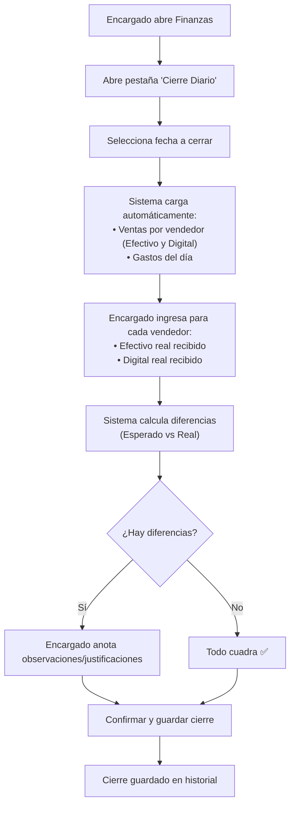

# Cierre Diario — Plan de Implementación

## Objetivo
Crear un módulo de **Cierre Diario** dentro de la sección de Finanzas que permita al encargado de finanzas:
1. Ver el resumen de ventas del día desglosado por vendedor y por método de pago (Efectivo / Digital).
2. Ver los gastos registrados en el día.
3. Ingresar los montos físicos y digitales reales reportados por cada vendedor para compararlos con el sistema.
4. Guardar el cierre como registro histórico consultable.

---

## Flujo de Uso

---

## Propuestos Cambios

### 1. Mejorar el Registro de Ventas (`Comp_ModalVenta.html` y `Service_Ventas.js`)
Para poder separar correctamente el dinero físico del digital en el cierre:
- **[NEW] Campo Método de Pago**: Se agregará un selector obligatorio en el modal de ventas con las opciones: "Efectivo" y "Digital/Transferencia".
- **[MODIFY] Hoja Ventas**: Se agregará una columna para guardar este dato, o se guardará dentro de las observaciones de la venta para no alterar la estructura actual. (Lo más seguro es guardarlo en una nueva columna o junto al canal de venta).

### 2. Nueva hoja: `CierresDiarios`
Estructura de columnas en Google Sheets:
| Col | Campo |
|-----|-------|
| A | ID_Cierre (ej. `CD-20260718-103000`) |
| B | Fecha del Cierre |
| C | Datos JSON (resumen completo por vendedor para el historial) |
| D | Total Ventas Sistema |
| E | Total Gastos Sistema |
| F | Total Efectivo Real |
| G | Total Digital Real |
| H | Diferencia |
| I | Estado (`Cuadrado` / `Con Diferencia`) |
| J | Encargado |
| K | Timestamp |
| L | Observaciones |

### 3. Backend — `Service_Finanzas.js`
- **[NEW] `obtenerResumenCierreDiario(fecha)`**: Busca las ventas del día, las agrupa por vendedor y por método de pago. Suma los gastos del día.
- **[NEW] `guardarCierreDiario(datos)`**: Guarda el registro en la hoja `CierresDiarios`.
- **[NEW] `obtenerHistorialCierres()`**: Devuelve el historial de cierres.

### 4. Frontend — `views_of_the_system.html` y `Global_JS.html`
- **[NEW] Sección Cierre Diario**: En la pestaña de Finanzas, se agregará un área dedicada al Cierre Diario con:
  - Formulario para cargar la fecha.
  - Tabla dinámica donde el encargado ingresa los montos reportados por cada vendedor.
  - Cálculo automático de diferencias (color rojo si falta dinero, verde si sobra/cuadra).
- **[NEW] Historial de Cierres**: Un listado tipo tabla o tarjetas para ver los cierres pasados, permitiendo expandir los detalles guardados en el JSON.

---

## Tareas a Ejecutar
1. Actualizar `config.js` con el nombre de la nueva hoja (`HOJA_CIERRES`).
2. Actualizar el modal de ventas y backend de ventas para registrar "Método de Pago".
3. Crear el backend del cierre diario en `Service_Finanzas.js`.
4. Crear la UI del cierre en `views_of_the_system.html`.
5. Integrar la lógica en `Global_JS.html`.

## Revisión del Usuario Requerida
Por favor, revisa el plan. **Si estás de acuerdo con agregar el "Método de Pago" al modal de ventas y con el flujo propuesto, presiona el botón "Proceed" (Proceder)** o déjame un comentario si quieres cambiar algo.
