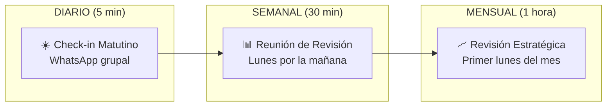
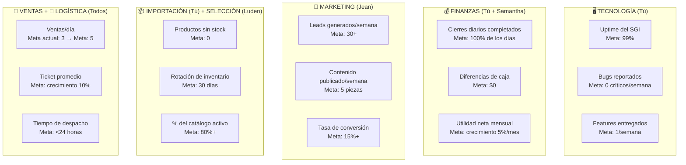
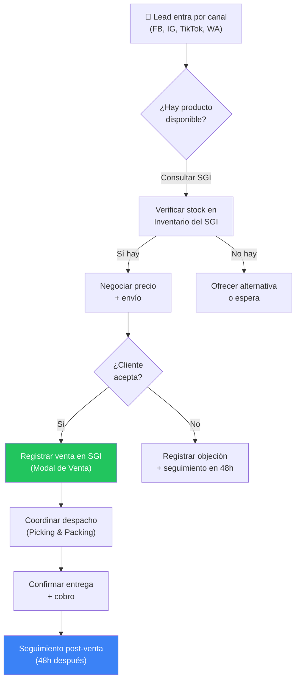
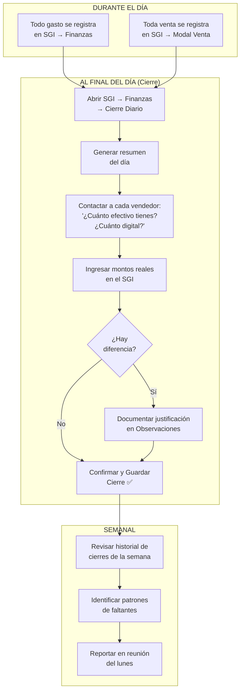
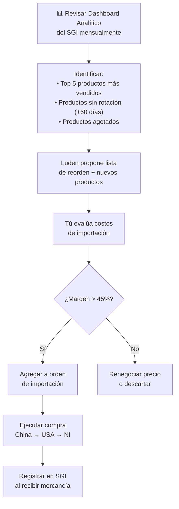
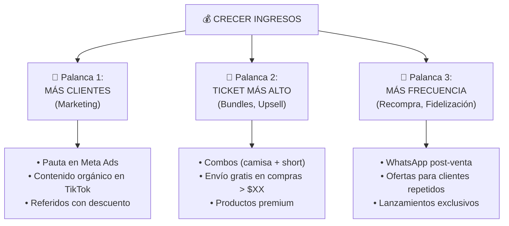
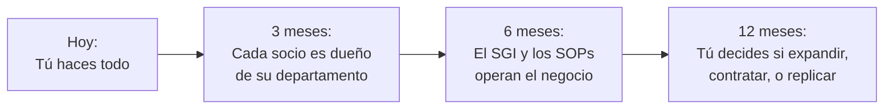

# ⚙️ Manual Operativo: La Comarca
## De Negocio Funcional a Máquina de Crecimiento

> **Propósito:** Convertir La Comarca de un negocio que "funciona bien" en una operación que pueda escalar, generar ingresos reales para los 4 socios, y operar con la mínima fricción posible.

---

## 1. El Problema Real (Diagnóstico Operativo)

Antes de resolver, hay que entender qué duele. Basado en el análisis de tu sistema y estructura:

| Síntoma | Causa Raíz |
|:---|:---|
| No sabes si todos están anotando todo en el SGI | No hay un mecanismo de **verificación diaria** |
| Tienes que preguntar "¿vendiste algo?" | No hay **reportes automáticos** que lleguen a ti |
| No sabes si el dinero cuadra hasta que tú lo revisas | El cierre diario depende de que **alguien lo ejecute** |
| Marketing no tiene métricas claras | No hay **KPIs definidos** para Jean |
| No sabes qué productos pedir en la próxima importación | No hay un **análisis de rotación** automatizado |
| Los socios no sienten urgencia de mejorar | No hay **metas compartidas** ni consecuencias claras |

> [!IMPORTANT]
> **La raíz de todo:** No tienes un **sistema de accountability** (rendición de cuentas). Tienes departamentos, pero no tienes un ciclo de medición → reporte → evaluación → ajuste que fuerce a cada área a mejorar continuamente.

---

## 2. Framework de Supervisión: El Ciclo Operativo Semanal

La supervisión no es "vigilar". Es crear un sistema donde **la información te llega a ti automáticamente** y donde cada socio sabe exactamente qué se espera de él.

### 2.1 Cadencia de Reuniones



#### ☀️ Check-in Diario (5 min — WhatsApp grupal)
Cada socio envía antes de las 10am un mensaje con este formato:

```
📍 [Nombre] — [Fecha]
✅ Ayer: [qué hice]  
🎯 Hoy: [qué haré]  
🚨 Bloqueos: [algo que me frena]
```

**Ejemplo real:**
```
📍 Jean — 23/Jul
✅ Ayer: Publiqué 3 reels de compresión en IG, respondí 12 DMs
🎯 Hoy: Grabar video TikTok de shorts nuevos, crear campaña de oferta
🚨 Bloqueos: Necesito fotos del nuevo stock de rodilleras
```

> [!TIP]
> **No es opcional.** Si alguien no envía el check-in, es una señal de que no está trabajando ese día o no tiene claridad de qué hacer. Ambos son problemas que debes resolver.

#### 📊 Reunión Semanal de Revisión (30 min — Lunes)
**Agenda fija e innegociable:**

| Min | Tema | Quién |
|:--|:---|:---|
| 0-5 | **Números de la semana** (ventas, gastos, utilidad) | Tú / Samantha |
| 5-10 | **Estado de inventario** (qué falta, qué sobra, qué pedir) | Luden |
| 10-15 | **Marketing** (leads generados, contenido publicado, conversión) | Jean |
| 15-20 | **Operaciones** (despachos pendientes, problemas logísticos) | Todos |
| 20-25 | **Compromisos de la semana** (1-3 metas cada uno) | Todos |
| 25-30 | **Decisiones pendientes** | Tú |

#### 📈 Revisión Mensual Estratégica (1 hora — Primer lunes)
- Comparar metas del mes vs. resultados reales
- Analizar el Dashboard Analítico del SGI (tendencias, canales, márgenes)
- Definir metas del mes siguiente
- Evaluar si hay que ajustar precios, cambiar productos, o pivotar estrategia

---

## 3. KPIs por Departamento (Lo que se mide, se mejora)

### 3.1 Cuadro de Mando Integral

Cada departamento tiene **3 métricas clave** que deben reportarse semanalmente. No más, no menos.



### 3.2 Tablero de Control Semanal

Este es el formato que debes llenar cada lunes con datos del SGI:

| Departamento | KPI | Meta | Real | Estado |
|:---|:---|:---|:---|:---|
| **Ventas** | Ventas totales de la semana | 15+ | ___ | 🟢🟡🔴 |
| **Ventas** | Ingreso bruto semanal | $___+ | ___ | 🟢🟡🔴 |
| **Ventas** | Ticket promedio | $___+ | ___ | 🟢🟡🔴 |
| **Finanzas** | Cierres diarios completados | 7/7 | ___/7 | 🟢🟡🔴 |
| **Finanzas** | Diferencias de caja acumuladas | $0 | $___ | 🟢🟡🔴 |
| **Marketing** | Leads nuevos (mensajes recibidos) | 30+ | ___ | 🟢🟡🔴 |
| **Marketing** | Contenido publicado | 5+ piezas | ___ | 🟢🟡🔴 |
| **Inventario** | Productos sin stock | 0 | ___ | 🟢🟡🔴 |
| **Logística** | Despachos completados en <24h | 100% | ___% | 🟢🟡🔴 |

> 🟢 = Cumplió o superó la meta  
> 🟡 = Alcanzó el 70-99%  
> 🔴 = Por debajo del 70%

> [!TIP]
> **Automatización futura:** Puedo programar en tu SGI un módulo que genere este tablero automáticamente cada lunes, extrayendo los datos directamente de las hojas de Ventas, Finanzas, Movimientos y CierresDiarios. Solo tendrían que agregar manualmente los KPIs de Marketing.

---

## 4. SOPs Operativos por Departamento

Un SOP (Procedimiento Operativo Estándar) es la receta que cualquiera puede seguir para hacer bien su trabajo **sin necesidad de que tú le expliques**.

### 4.1 SOP de Ventas (Todos los vendedores)



**Reglas inquebrantables:**
1. ✅ **Toda venta se registra en el SGI ANTES de despachar.** Sin excepción.
2. ✅ **Se selecciona el almacén correcto** de donde sale el producto.
3. ✅ **Se registra el método de pago** (Efectivo o Digital).
4. ✅ **Se registra el canal de venta** (para saber qué canal funciona mejor).
5. ✅ **Seguimiento post-venta a las 48 horas** (foto del cliente usando el producto = contenido para marketing).

### 4.2 SOP de Logística (Despacho)

| Paso | Acción | Responsable | Tiempo Máximo |
|:--|:---|:---|:---|
| 1 | Recibir notificación de venta registrada | Despachador asignado | Inmediato |
| 2 | Localizar producto en el almacén correcto (Picking) | Despachador | 30 min |
| 3 | Verificar calidad del producto (sin defectos, talla correcta) | Despachador | 5 min |
| 4 | Empacar con estándar de marca (Packing) | Despachador | 10 min |
| 5 | Coordinar entrega (presencial o motorizado) | Despachador | 2 horas |
| 6 | Confirmar entrega y cobro al vendedor | Despachador | Inmediato |
| 7 | Reportar completado en grupo de WhatsApp | Despachador | 5 min |

**Escenario de fallo:** Si el producto no está donde dice el SGI:
1. Reportar inmediatamente en el grupo
2. Hacer ajuste de inventario en el SGI (módulo Movimientos)
3. Ofrecer alternativa al cliente o reprogramar entrega

### 4.3 SOP de Finanzas (Tú + Samantha)



**Regla de oro:** Si un vendedor tiene faltante de caja **2 veces en la misma semana**, se hace una conversación directa para entender por qué. No se trata de desconfiar, sino de encontrar el error operativo (¿se le olvidó registrar un gasto? ¿le dieron mal el cambio?).

### 4.4 SOP de Marketing (Jean)

**Calendario semanal mínimo de contenido:**

| Día | Tipo de Contenido | Plataforma | Ejemplo |
|:--|:---|:---|:---|
| Lunes | Producto destacado (foto studio) | Instagram Feed | "Nuevo short de compresión 🔥" |
| Martes | Video corto de uso/review | TikTok + Reels | Cliente usando el producto en gym |
| Miércoles | Historia interactiva (encuesta/quiz) | Instagram Stories | "¿Team shorts o Team leggings?" |
| Jueves | Publicación de oferta o bundle | Facebook + IG | "Combo camisa + strap a $XX" |
| Viernes | Contenido UGC (User Generated) | TikTok + Reels | Repost de cliente satisfecho |

**Métricas que Jean debe reportar cada lunes:**
1. **Alcance total** de la semana (views/impresiones)
2. **Mensajes recibidos** (leads nuevos)
3. **De esos leads, cuántos se convirtieron en venta** (tasa de conversión)

### 4.5 SOP de Selección de Productos e Importación



**Regla clave para Luden:** Nunca pedir un producto nuevo sin validar demanda primero. Método: publicar el producto como "próximamente" en redes y medir cuántos mensajes genera antes de hacer la compra.

---

## 5. Sistema de Accountability (Rendición de Cuentas)

### 5.1 Contrato de Compromisos entre Socios

Cada socio tiene compromisos **medibles y semanales**:

| Socio | Compromiso Semanal Mínimo | Cómo se Verifica |
|:---|:---|:---|
| **Tú** | SGI funcionando sin bugs + Cierres diarios al día | SGI operativo + Historial de cierres |
| **Samantha** | Co-ejecutar cierres diarios + Reportar utilidad semanal | Hoja CierresDiarios + Reporte lunes |
| **Jean** | 5 piezas de contenido + Reportar leads y conversión | Publicaciones visibles + Reporte lunes |
| **Luden** | Análisis de rotación + Propuesta de reorden mensual | Documento de análisis + Propuesta |
| **Todos** | Registrar 100% de ventas en el SGI + Check-in diario | SGI (verificable) + WhatsApp grupal |

### 5.2 Regla del Semáforo de Cumplimiento

Al final de cada mes, cada socio se evalúa con el semáforo:

- 🟢 **Verde:** Cumplió el 90%+ de sus compromisos → Participa normalmente de utilidades
- 🟡 **Amarillo:** Cumplió el 70-89% → Se discute en reunión mensual, se acuerda plan de mejora
- 🔴 **Rojo:** Menos del 70% → Conversación seria sobre permanencia o redistribución de responsabilidades

> [!WARNING]
> **Esto DEBE formalizarse.** Escríbanlo en un documento firmado por los 4. No tiene que ser un contrato legal, pero sí un acuerdo escrito que todos validen. La ambigüedad es el enemigo #1 de las sociedades.

---

## 6. Oportunidades de Automatización con el SGI

Cosas que el SGI **puede hacer por ustedes** y que hoy hacen manualmente:

| # | Automatización | Beneficio | Esfuerzo de Implementación |
|:--|:---|:---|:---|
| 1 | **Reporte semanal automático** enviado por email cada lunes | Elimina la preparación manual de datos para la reunión | Medio (trigger de GAS + email) |
| 2 | **Alerta de stock bajo** por WhatsApp/email | Nunca más perder una venta por falta de stock | Medio (trigger + alertas) |
| 3 | **Recordatorio de cierre diario** si no se ha hecho a las 8pm | Asegura que el cierre se haga todos los días | Bajo (trigger temporal) |
| 4 | **Dashboard de KPIs semanales** automático en el SGI | Tablero de control sin esfuerzo manual | Medio (nueva vista en SGI) |
| 5 | **Análisis de rotación de productos** automático | Saber qué pedir y qué dejar de comprar sin análisis manual | Ya existe parcialmente en Analytics |
| 6 | **Catálogo digital** generado desde el SGI | Jean puede compartir link de productos actualizado en redes | Alto (nueva funcionalidad) |
| 7 | **Seguimiento post-venta** con recordatorio a las 48h | Aumentar recompra y obtener contenido UGC | Medio (trigger + notificación) |

> [!TIP]
> Las automatizaciones #1, #3 y #4 son las que más impacto tienen con menor esfuerzo. Te recomiendo implementarlas primero. Puedo programarlas directamente en tu SGI cuando me lo indiques.

---

## 7. Modelo Financiero: ¿Cuándo es "Suficiente" para Vivir de Esto?

### 7.1 Realidad Actual

| Concepto | Valor Estimado |
|:---|:---|
| Ventas diarias | 2-3 ventas |
| Ticket promedio estimado | ~$25-40 USD |
| Ingreso bruto mensual | ~$1,500-3,600 USD |
| Margen bruto (52%) | ~$780-1,872 USD |
| Gastos fijos | -$100 USD |
| Pago de deuda | -$200 USD (2 cuotas restantes) |
| **Utilidad neta estimada** | **~$480-1,572 USD/mes** |
| Utilidad por socio (÷4) | **~$120-393 USD/mes** |

### 7.2 Escenarios de Escalamiento

| Escenario | Ventas/Día | Ingreso Bruto/Mes | Utilidad Neta/Mes | Por Socio/Mes |
|:--|:---|:---|:---|:---|
| **Actual** | 2-3 | ~$2,250 | ~$1,070 | **~$267** |
| **Meta Corto Plazo** (3 meses) | 5 | ~$4,500 | ~$2,240 | **~$560** |
| **Meta Medio Plazo** (6 meses) | 8 | ~$7,200 | ~$3,640 | **~$910** |
| **Meta Agresiva** (12 meses) | 15 | ~$13,500 | ~$6,900 | **~$1,725** |

> *Supuestos: Ticket promedio $30, margen 52%, gastos fijos crecen a $200 en Meta, sin deuda*

### 7.3 Las 3 Palancas de Crecimiento

Para pasar de 2-3 ventas/día a 15 ventas/día, solo hay **3 palancas**:



### 7.4 Checklist de Madurez Pre-Expansión

Antes de invertir en crecimiento agresivo, **estos 10 puntos deben estar en verde:**

| # | Requisito | Estado | Prioridad |
|:--|:---|:---|:---|
| 1 | Todas las ventas se registran en el SGI (100%) | ⬜ Verificar | 🔴 Crítica |
| 2 | Cierres diarios se hacen todos los días | ⬜ Verificar | 🔴 Crítica |
| 3 | Deuda liquidada completamente | ⬜ 2 cuotas restantes | 🟡 Alta |
| 4 | Todos los socios cumplen check-in diario | ⬜ Implementar | 🟡 Alta |
| 5 | Reunión semanal se hace sin falta | ⬜ Implementar | 🟡 Alta |
| 6 | Marketing produce 5+ piezas de contenido/semana | ⬜ Verificar | 🟡 Alta |
| 7 | Tiempo de despacho < 24 horas consistente | ⬜ Verificar | 🟡 Alta |
| 8 | SGI seguro (no acceso público anónimo) | ⬜ Pendiente | 🔴 Crítica |
| 9 | Fondo de emergencia de 1 mes de gastos operativos | ⬜ Construir | 🟠 Media |
| 10 | Al menos 1 mes de data limpia y consistente en el SGI | ⬜ Medir | 🟡 Alta |

> [!IMPORTANT]
> **No inviertas en pauta de Meta Ads hasta que los primeros 8 puntos estén en verde.** Invertir en traer más clientes cuando la operación interna no está lista es tirar dinero: los leads llegarán pero no se convertirán eficientemente, los despachos se atrasarán, y el dinero no se cuadrará.

---

## 8. Plan de Acción Inmediato (Próximos 30 Días)

### Semana 1: Fundamentos
- [ ] Formalizar el acuerdo de compromisos entre los 4 socios (documento escrito)
- [ ] Implementar el check-in diario en WhatsApp
- [ ] Primera reunión semanal formal con la agenda propuesta
- [ ] Asegurarse de que el cierre diario se ejecute TODOS los días

### Semana 2: Medición
- [ ] Definir las metas numéricas de cada KPI (ventas/día, ticket promedio, etc.)
- [ ] Jean presenta su calendario de contenido del mes
- [ ] Luden presenta análisis de rotación del catálogo actual
- [ ] Tú implementas la seguridad del SGI (quitar acceso anónimo)

### Semana 3: Optimización
- [ ] Revisar los primeros datos de KPIs — ¿dónde estamos vs. la meta?
- [ ] Identificar el cuello de botella #1 (¿marketing? ¿despachos? ¿producto?)
- [ ] Implementar automatización de reporte semanal en el SGI
- [ ] Implementar alerta de recordatorio de cierre diario

### Semana 4: Evaluación
- [ ] Primera revisión mensual estratégica completa
- [ ] Evaluar semáforo de cada socio
- [ ] Decidir si estamos listos para invertir en pauta digital
- [ ] Ajustar metas del mes siguiente basado en datos reales

---

## 9. Mentalidad de Escalamiento

> *"Un negocio que depende de ti para funcionar es un empleo disfrazado. Un negocio que funciona SIN ti es un activo."*

### La Meta Final



**Lo que necesitas internalizar:**
1. **Tu trabajo no es vender.** Tu trabajo es **construir el sistema** que permite vender.
2. **No controles a tus socios.** Construye un sistema donde **los datos los controlen.**
3. **Si no está en el SGI, no pasó.** Esta debe ser la cultura del equipo.
4. **Medir antes de mejorar.** Un mes de datos limpios vale más que cualquier intuición.

---

> [!NOTE]
> Este manual es un documento vivo. A medida que implementes cada fase y recopiles datos reales, lo iremos ajustando. Lo importante es **empezar hoy con lo más simple**: el check-in diario y el cierre diario sin falta. Todo lo demás se construye encima de eso.
