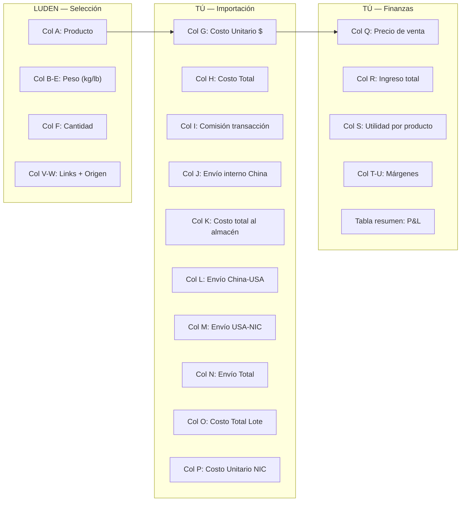

# SOP Detallado: Selección de Productos — Basado en tu Proceso Real

> **Basado en:** Archivo `Importaciones 2026.xlsx` (5 importaciones: Enero → Junio-Julio + 1 posible inversión)

---

## Cómo funciona hoy: Los 3 roles en la tabla de costos

Tu tabla de 23 columnas ya define claramente quién hace qué. Así se divide:



| Columna | Responsable | Qué llena |
|---|---|---|
| A (Producto) | **Luden** | Nombre del producto seleccionado |
| B-E (Pesos) | **Luden** | Peso unitario en kg → fórmulas calculan libras y totales |
| F (Cantidad) | **Luden** | Cuántas unidades propone comprar |
| G (Costo Unitario $) | **Tú** | Precio del proveedor en USD |
| H (Costo Total) | Fórmula | = Cantidad × Costo Unitario |
| I (Comisión) | **Tú** | ~5% comisión de plataforma (1688/Alibaba) o monto fijo |
| J (Envío interno China) | **Tú** | Costo del envío dentro de China al almacén |
| K (Costo total al almacén) | Fórmula | = Costo Total + Comisión + Envío interno |
| L (Envío China→USA) | Fórmula | = Peso total lb × tarifa/lb ($1.40/lb) |
| M (Envío USA→NIC) | Fórmula | = Peso total lb × tarifa/lb ($2.00-2.50/lb) |
| N (Envío Total) | Fórmula | = China-USA + USA-NIC |
| O (Costo Total Lote) | Fórmula | = Costo al almacén + Envío Total |
| P (Costo Unitario NIC) | Fórmula | = Costo Total Lote ÷ Cantidad |
| Q (Precio de venta) | **Tú (Finanzas)** | Precio en USD al que se venderá |
| R-U (Ingresos/Utilidad/Márgenes) | Fórmulas | Se calculan automáticamente |
| V-W (Links/Origen) | **Luden** | URL del proveedor + plataforma |

---

## Tu historial: Evolución de las 5 importaciones

| Importación | Productos | Unidades | Inversión Total | Ingreso Esperado | Utilidad Bruta | Margen Bruto | Margen Neto |
|---|---|---|---|---|---|---|---|
| **Enero** | 9 | 167 | $873 | $1,497 | $699 | 46.7% | 26.6% |
| **Febrero** | 7 | 182 | $978 | $1,601 | -$242 ⚠️ | **-416%** | **-1181%** |
| **Abril-Mayo** | 8 | 195 | $1,124 | $2,147 | $1,022 | 47.6% | 29.0% |
| **Junio-Julio** | 6 | 182 | $1,177 | $2,007 | $830 | 41.3% | 41.3% |
| **Posible Inv.** | 8 | 111 | $1,134 | $2,470 | $1,336 | 54.1% | 54.1% |

> [!WARNING]
> **Febrero fue un desastre financiero.** Utilidad bruta de **-$242** y neta de **-$688**. Las fórmulas de la tabla de finanzas en esa hoja tienen los campos intercambiados (Ingresos = $58, Costo productos = $15, Costo envío = $285, Marketing = $445). Parece que los costos de envío y marketing absorbieron toda la utilidad. **Lección: el resumen P&L debe validarse siempre contra la tabla de arriba.**

### Productos estrella (aparecen en múltiples importaciones y con buen margen)

| Producto | Veces importado | Margen promedio sobre venta | Veredicto |
|---|---|---|---|
| **Camisa de compresión** | 5/5 importaciones | ~49% | ⭐ **Producto insignia. Nunca quedarse sin stock** |
| **Enterizo deportivo** | 3/5 | ~45% | ⭐ Consistente y con buen margen |
| **Camisa compresión manga larga** | 2/5 | ~50% | ⭐ Excelente margen, ampliar |
| **Straps** | 1/5 | 55.6% | ⭐ Mejor margen del catálogo. ¿Por qué solo 1 vez? |
| **Cinturón gym** | 2/5 | ~47% | 🟡 Buen margen, pero baja rotación (12 unidades max) |

### Productos problemáticos

| Producto | Problema | Decisión |
|---|---|---|
| **Chalecos de lana** (Feb) | Margen 22% — el más bajo de todo el historial | 🔴 No reordenar. El margen no justifica el esfuerzo |
| **Soporte de laptop** (Feb) | Margen 39%, fuera del nicho fitness | 🔴 No reordenar. No es tu cliente |
| **Mochila antirobo** (Feb) | Margen 41%, fuera del nicho | 🔴 No reordenar |
| **Jogger estilo 1** (Feb) | Margen 41%, importado con chalecos (lote perdedor) | 🟡 Evaluar si hay demanda real |
| **HUD 8 puertos** (Web) | 0 ventas, agotado | 🔴 Descontinuado. No es del nicho |
| **Mouse Pad** (Web) | 0 ventas, agotado | 🔴 Descontinuado. No es del nicho |

> [!IMPORTANT]
> **Patrón claro:** Cada vez que se metieron productos fuera del nicho fitness (soporte laptop, mochila, HUD, mouse pad), no vendieron o vendieron con márgenes bajos. **La lección para Luden: quedarse dentro del nicho deportivo/fitness.**

---

## Las 6 actividades del área — Adaptadas a tu proceso real

### Actividad 1: Análisis ABC con datos del SGI (Luden — Mensual)

**Objetivo:** Saber qué productos reordenar y en qué cantidad.

**Paso a paso:**

1. Abrir SGI → Dashboard Analítico → "Productos más vendidos"
2. Para cada producto del catálogo actual, anotar:

| Producto | Ventas últimos 30 días | Stock actual | Costo Unitario NIC (Col P) | Precio venta (Col Q) | Margen |
|---|---|---|---|---|---|
| Camisa compresión | ___ | ___ | $3.76 | $8.15 | 54% |
| Straps | ___ | ___ | $2.66 | $6.00 | 56% |
| _(llenar todos)_ | | | | | |

3. Clasificar:
   - **A** (reordenar): Vendió 5+/mes y margen > 40%
   - **B** (mantener): Vendió 2-4/mes o margen 30-40%
   - **C** (liquidar): 0-1 venta/mes o margen < 30%

**Entregable:** Lista clasificada enviada al grupo de WhatsApp + presentada el lunes.

---

### Actividad 2: Búsqueda de productos nuevos (Luden — Quincenal)

**Objetivo:** Encontrar productos que amplíen el catálogo dentro del nicho.

**Dónde buscar:**

| Fuente | Qué buscar | Cómo |
|---|---|---|
| **1688.com** | Productos fitness trending | Buscar por categoría deportiva, ordenar por ventas |
| **Alibaba** | Productos con MOQ bajo | Filtrar por "Min Order: 1-10 pcs" para probar |
| **Clientes** | "¿Tienen X?" | Anotar cada vez que alguien pregunte por algo que no tenemos |
| **Competencia** | ¿Qué venden otros en Marketplace Managua? | Revisar perfiles de competidores 1x/semana |
| **TikTok/IG** | Tendencias fitness | ¿Qué productos aparecen en videos virales de gym? |

**Filtro obligatorio antes de proponer (las 4 preguntas):**

```
✅ ¿Es del nicho fitness/deportivo?
   → Si no, DESCARTARLO. (Lección: HUD, Mouse Pad, Laptop stand)

✅ ¿Al menos 3 personas lo han pedido o hay demanda visible?
   → Si no, validar con post "próximamente" antes de comprar

✅ ¿El precio de venta cabe en el rango C$150–C$900?
   → Ese es tu sweet spot en Managua

✅ ¿El peso es manejable? (< 1 lb por unidad ideal)
   → Productos pesados comen margen en envío
```

**Ficha de producto nuevo (Luden la llena):**

| Campo | Valor |
|---|---|
| Nombre | |
| Link del proveedor | |
| Origen (1688/Alibaba) | |
| Precio proveedor (USD) | |
| Peso unitario (kg) | |
| MOQ (mínimo de compra) | |
| ¿Quién lo pidió / demanda visible? | |
| Precio de venta propuesto (USD) | |
| Margen estimado | |

**Entregable:** 2-3 fichas de producto presentadas en la reunión semanal.

---

### Actividad 3: Validación de demanda (Luden + Jean — Antes de comprar)

**Objetivo:** Confirmar que hay gente real que quiere comprar el producto antes de invertir.

**Método (el que ya conocen — post de "Próximamente"):**

1. Jean crea la publicación con foto del producto (puede ser la del proveedor)
2. Texto: *"🔥 Próximamente: [producto]. Escribí 'LO QUIERO' si te interesa"*
3. Publicar en: Perfil personal de cada socio + Marketplace + 2 grupos de fitness
4. Esperar 48-72h

| Reacciones | Decisión |
|---|---|
| 10+ "lo quiero" | ✅ Comprar cantidad normal |
| 5-9 | 🟡 Comprar mínimo para probar (5-10 uds) |
| 0-4 | 🔴 No comprar |

---

### Actividad 4: Llenar la tabla de costos (Tú + Luden — Antes de cada importación)

**Objetivo:** Completar la hoja de Excel de importación con datos reales para saber exactamente cuánto cuesta y cuánto ganan.

**Flujo de trabajo paso a paso:**

```
1. Luden crea nueva hoja en el Excel (copiar formato de "Junio-Julio")
   → Llena: Producto, Peso, Cantidad, Link, Origen

2. Tú completas:
   → Costo Unitario $ (negociado con el proveedor)
   → Comisión sobre transacción
   → Costo envío interno en China
   → Verificar tipo de cambio (Fila 5: $36.62)
   → Verificar tarifas de envío por libra (USA-NIC: $2.00-2.50)

3. Las fórmulas calculan automáticamente:
   → Costo Total Lote (Col O)
   → Costo Unitario NIC (Col P)
   → Ingreso total (Col R)
   → Utilidad por producto (Col S)
   → Márgenes (Col T-U)

4. Tú completas la tabla de P&L de abajo:
   → Ingresos totales
   → Costos de operación (productos + envío + marketing)
   → Utilidad bruta y neta
   → Márgenes finales
```

> [!WARNING]
> **Punto crítico: Verificar la tabla de P&L.** En la hoja de Febrero, la tabla de resumen tenía datos incorrectos (Ingresos = $58 cuando la tabla de arriba dice $1,600). Siempre validar que la tabla de abajo coincida con los totales de la fila "Total" de la tabla de costos de arriba.

**Reglas de decisión por margen:**

| Margen sobre venta del producto | Decisión |
|---|---|
| **> 50%** | ✅ Excelente. Comprar con confianza |
| **40-50%** | ✅ Bueno. Comprar |
| **30-40%** | 🟡 Aceptable solo si es producto estrella con alta rotación |
| **< 30%** | 🔴 No comprar. Negociar mejor precio o subir precio de venta |

---

### Actividad 5: Gestión del catálogo activo (Luden — Mensual)

**Objetivo:** Que el catálogo solo tenga productos que se venden y que estén correctamente publicados.

**Checklist mensual:**

- [ ] ¿Hay productos agotados en lacomarcanic.com? → Ocultar o marcar "Próximamente"
- [ ] ¿Hay productos sin categoría? → Corregir (ej: Enterizo estaba en "Sin categoría")
- [ ] ¿Hay productos Clase C con stock? → Activar liquidación con descuento
- [ ] ¿Todos los productos Clase A están publicados en Marketplace? → Si no, publicarlos
- [ ] ¿Los precios de la web coinciden con los precios reales? → Actualizar si cambiaron
- [ ] ¿Hay productos nuevos que aún no están en la web? → Agregarlos

---

### Actividad 6: Preparar orden de importación (Luden presenta → Tú apruebas)

**Cuándo:** Cada vez que los productos Clase A tengan menos de 1 mes de stock.

**Propuesta de Luden debe incluir:**

| Producto | Clase | Stock Actual | Ventas/Mes | Meses de Stock | Cantidad Propuesta | Justificación |
|---|---|---|---|---|---|---|
| Camisa compresión | A | 5 | 15 | 0.3 | 50 | Producto #1, casi agotado |
| Straps | A | 2 | 8 | 0.25 | 20 | Margen 56%, alta demanda |
| Bandas resistencia | NUEVO | 0 | — | — | 10 | Validado: 12 interesados |
| Chaleco lana | C | 3 | 0 | ∞ | 0 | No reordenar. Liquidar |

**Tú apruebas si:**
1. La inversión total cabe en el presupuesto disponible
2. Ningún producto tiene margen < 35%
3. Los productos nuevos pasaron la validación de demanda
4. No se están reordenando productos Clase C

---

## Calendario mensual consolidado

| Semana | Luden hace | Tú haces |
|---|---|---|
| **1** | Análisis ABC con datos del SGI | Revisas y validas los números |
| **1** | Limpia catálogo (web + Marketplace) | — |
| **2** | Investiga 2-3 productos nuevos + llena fichas | — |
| **2-3** | Coordina con Jean los posts de validación | — |
| **3** | Prepara propuesta de importación (productos + cantidades) | Llenas costos en la tabla de Excel |
| **4** | — | Completas P&L, apruebas o ajustas la orden |
| **4** | — | Ejecutas la compra con el proveedor |

---

## Mejoras sugeridas a tu tabla actual

| Mejora | Por qué | Esfuerzo |
|---|---|---|
| Agregar columna "Clase ABC" | Para ver de un vistazo si vale la pena reordenar | 🟢 Bajo |
| Agregar columna "Ventas reales del lote anterior" | Para comparar proyección vs realidad | 🟢 Bajo |
| Agregar columna "Días para agotar stock" | Para saber cuándo reordenar | 🟢 Bajo |
| Validar fórmulas de la tabla P&L de Febrero | Los datos no cuadran con la tabla de costos | 🔴 Urgente |
| Estandarizar tarifas de envío (col D26) | Pasaron de $2.00/lb a $2.50/lb sin documentar por qué | 🟡 Medio |
